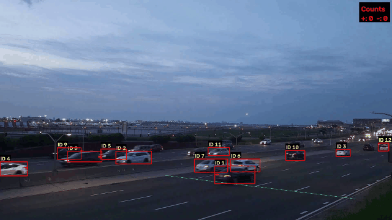

# Vehicle Counting and Speed Estimation



Reads video from a fixed roadside camera, detects vehicles with YOLO (Ultralytics YOLO26), tracks them with
ByteTrack, counts how many cross a line in each direction, and estimates each vehicle's speed from a
pixel-to-meter homography calibrated on the road's lane markings. A FastAPI endpoint wraps the pipeline.

## Results

Reported on **60 to 120 s** (frames 1800 to 3599, 1 minute) of the clip, near carriageway only.
Same clip, machine and settings for all three models; only the model changes.

| Model | Counts (+/-), program vs hand | + error | - error | Count error | Speed MAE | Speed bias | Speed MAPE | FPS |
|---|---|---|---|---|---|---|---|---|
| yolo26n | +83/83, -0/0 | 0.0% | n/a | 0.0% | n/a | n/a | n/a | 58.6 |
| yolo26s | +85/83, -0/0 | 2.4% | n/a | 2.4% | n/a | n/a | n/a | 54.9 |
| yolo26m | +86/83, -0/0 | 3.6% | n/a | 3.6% | n/a | n/a | n/a | 44.7 |

- Hand count for - is 0, so the count error comes from the + direction only.
- Count error = `percent_error(program +, hand +) + percent_error(program -, hand -)`, where
  `percent_error(measured, truth) = |measured - truth| / truth x 100`.
- Speed columns are `n/a`: there is no independent speed measurement for this clip (see "Speed").
- FPS = frames the program processed per second (detection + tracking + counting + speed, no video writing),
  not counting the first 5 frames (model warm-up). The video itself is 30 fps.
- **Why small and medium count more:** every extra count is one vehicle that got two boxes, so two track IDs
  crossed the line in the same frame at the same spot (s: frames 1945 and 3278; m: frames 3278, 3479 and 3550,
  checked by drawing the boxes). Every crossing nano counted was also counted by s and m. Nano's total matching
  the hand count does not prove each car was matched one to one; the counts were compared as totals only.

**Machine:** NVIDIA GeForce RTX 5060 Laptop GPU, Intel Core Ultra 7 255H, Windows 11.
Python 3.14.6, torch 2.14.1+cu130, ultralytics 8.4.172, opencv-python 5.0.0.

## Definitions

- **Reference point** of a vehicle = bottom-center of its box, `((x1 + x2) / 2, y2)`. Used for both counting and speed.
- **Count:** a vehicle is counted once, the first time its reference point crosses the counting line
  (green line in the GIF) between two frames.
- **Positive / negative:** on this footage, **+ = moving left to right** on screen, **- = right to left**.
  On the near carriageway all traffic moves left to right.
- **Speed (km/h):** the reference point is converted to road meters with the homography. Speed = distance
  between the position now and 10 frames earlier (0.33 s), divided by the time between them from the
  **video's** frame numbers and fps (never the computer clock), x 3.6. Only measured inside the speed zone
  (the 5 near lanes over the calibrated stretch). A vehicle's reported speed is the mean of its readings.

## Counting ground truth

Hand count of the same minute (60 to 120 s) from a copy of the clip with only the counting line and a
time / frame stamp drawn on it (`scripts/annotate_line.py`). Counted before seeing the program's numbers,
near carriageway only, per direction, with the same definition as the program (bottom-center crosses the line).
Result: 83 left to right, 0 right to left. One person, one pass.

## Speed (estimates only)

There is **no independent speed measurement** for this clip (no GPS, radar or timed pass), so speed error
cannot be computed. The machinery for it exists (`metrics.speed_errors`, speed clips in `benchmark.py`).

Sanity check against the posted limit: this stretch of the Grand Central Parkway is posted at **50 mph (80.5 km/h)**.
Mean speed per vehicle over the reported minute:

| Model | Vehicles with a speed | Median | Mean | 10th to 90th percentile |
|---|---|---|---|---|
| yolo26n | 84 | 80.6 km/h | 81.2 km/h | 65.7 to 99.3 km/h |
| yolo26s | 87 | 79.2 km/h | 81.6 km/h | 66.5 to 99.5 km/h |
| yolo26m | 86 | 80.2 km/h | 82.0 km/h | 65.5 to 100.4 km/h |

The median is close to the limit, which is plausible for free-flowing parkway traffic, but it is not a validation.
Single readings within one vehicle vary about +-10 to 15 km/h (box jitter over a 0.33 s window).

## Calibration

**Source of real distances:** the road's own lane markings, not a measured distance. Assumed NYSDOT standard
broken lane line: 10 ft dash + 30 ft gap, so one cycle = 40 ft = 12.192 m, dash = 3.048 m; lane width 12 ft = 3.6576 m.
**None of this is independently verified.** The road may be repainted or built to a different standard.

21 points (dash starts and ends on 4 lane lines x 3 dash rows) were located to sub-pixel on a vehicle-free
median image of the first 45 frames. The homography is fitted meters-to-pixels (so the error is minimized in
pixels, where the measurement noise is) and inverted.

| Check (`tools/calibration_report.py`) | Result |
|---|---|
| Pixel reprojection error, RMS / max | 2.78 px / 4.98 px |
| Position error of the 21 points in meters, RMS / max | 0.164 m / 0.370 m |
| Held-out test: fit rows 1 and 2 only, predict row 3 | mean 0.34 m (0.16 to 0.67 m) |
| Held-out row 2 to row 3 spacing on lines a, b, c (true 12.19 m) | 12.17, 12.50, 12.77 m |
| Solid edge line should have constant X | -4.40, -4.39, -4.33 m |

These are consistency checks. They rely on the same lane-marking assumption, so they do **not** verify the absolute scale.

**Sensitivity** (vehicle at 90 km/h, 10-frame window):
- Lane width +-10%: about 0.1 km/h (speed along the road depends on the dash cycle, not the lane width).
- Random 2 px error on the calibration points: about +-0.4 km/h.
- A wrong dash cycle length scales every speed by the same percentage (a 3 m / 9 m metric pattern would make true speeds about 1.6% lower than reported).
- Camera drift (homography not updated): speeds read about 1% low at 17 s, 1 to 3% high around 60 s, 1 to 5% high near 110 s.

## Limitations

- One clip: one camera, dusk, one road. The reported minute is only 1 minute long.
- Settings (`conf`, `iou`, window, line, zone) were picked from spot checks on 0 to 10 s, which is part of the
  same clip (tuning part 0 to 60 s, reported part 60 to 120 s, same camera and conditions). They were not changed
  after looking at 60 to 120 s.
- The camera is not perfectly fixed: the road drifts by up to about 50 to 85 px during the clip. The calibration
  and the line are fixed to frame 0, so the line shifts relative to the road and speeds drift by a few percent.
  No stabilization.
- Near carriageway only. Far-lane vehicles are small and partly hidden by the median barrier.
- A car in the barrier-side lane hidden behind a nearer car can lose its track before crossing and be missed.
- Larger models sometimes put two boxes on one vehicle, which counts it twice (see Results).
- Vehicles already past the line in the first processed frame are not counted.
- Speed is not validated against an independent measurement; the scale rests on an assumed marking standard.

## Footage

[Traffic at Grand Central Parkway in New York](https://www.pexels.com/video/traffic-at-grand-central-parkway-in-new-york-12451967/),
from Pexels, under the [Pexels license](https://www.pexels.com/license/) (free to use). Video files are not in this
repo; download the clip from that page and export it at 1920 x 1080, 30 fps as `footage/Untitled design.mp4`.
`tests/data/` holds a frame and a 35-frame crop cut from it.

## How to run

```powershell
python -m venv .venv
.\.venv\Scripts\Activate.ps1
pip install torch torchvision --index-url https://download.pytorch.org/whl/cu130   # NVIDIA GPU; skip for CPU
pip install -r requirements.txt
```

- Tests: `pytest`
- Demo video + GIF: `python scripts/make_demo.py [start_s] [seconds]`
- Benchmark (n / s / m table): `python benchmark.py`
- Calibration report: `python tools/calibration_report.py`
- Hand-count video: `python scripts/annotate_line.py "footage/Untitled design.mp4" footage/count_60_120.mp4 60 120`
- API: `uvicorn main:app`, then
  - `GET /health` returns `{"status": "ok"}`
  - `POST /analyze` with a `.mp4`, `.avi` or `.mov` file in the `video` field returns counts and per-vehicle speeds:
    ```powershell
    curl.exe -F "video=@footage/clip.mp4" http://127.0.0.1:8000/analyze
    ```
    The calibration is for this camera view only; other footage needs its own calibration points.
    The model loads per request, and one video is handled at a time.
